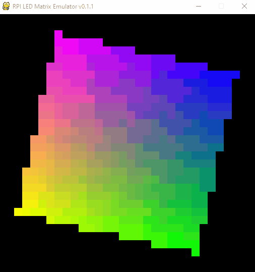
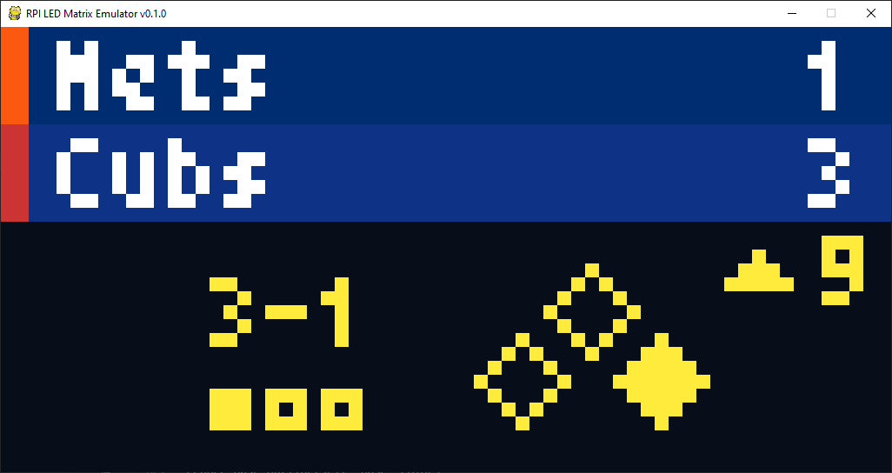
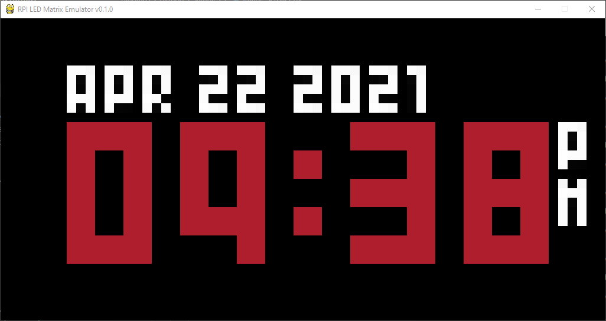
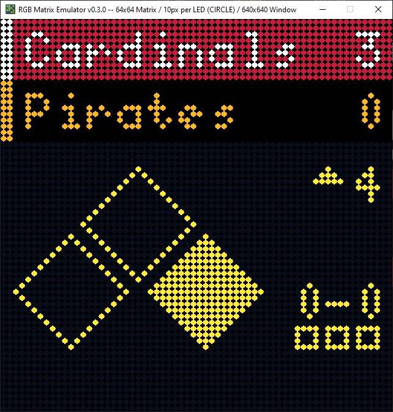
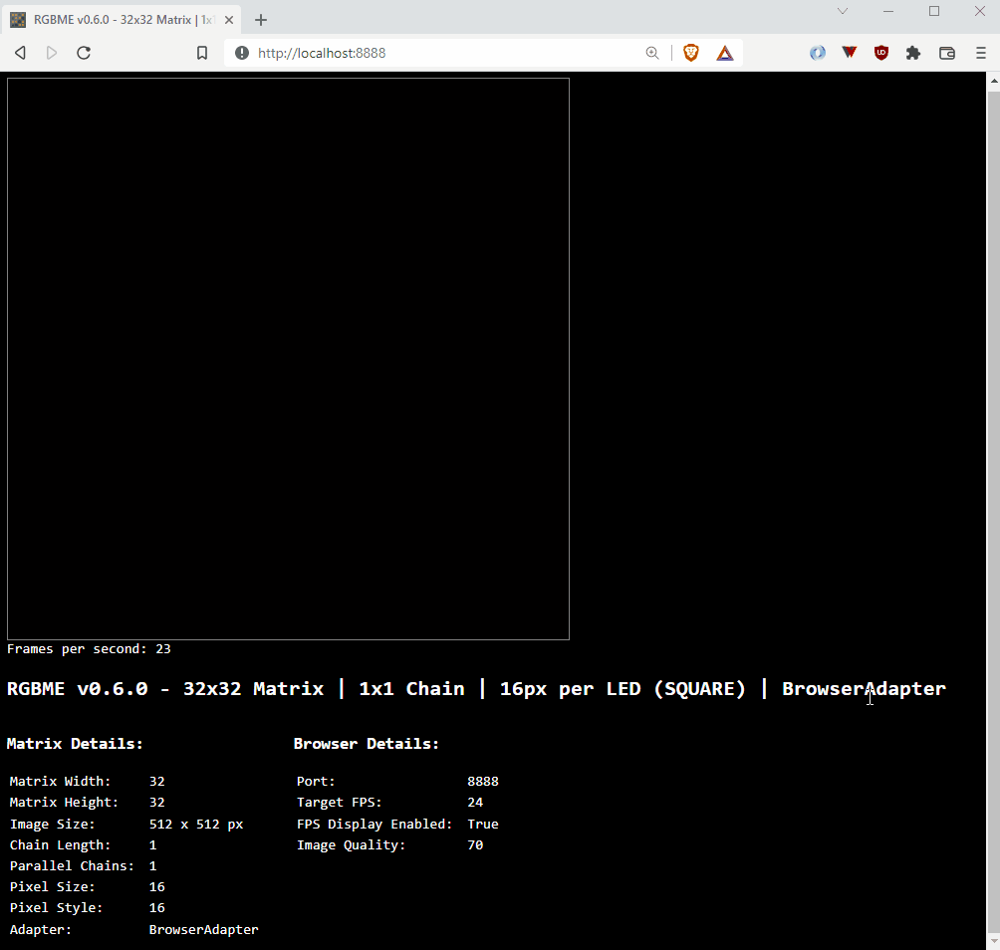

# `RGBMatrixEmulator`

[](https://pypi.org/project/RGBMatrixEmulator/)


`RGBMatrixEmulator` is a Python package for emulating RGB LED matrices that are normally driven by the [rpi-rgb-led-matrix library](https://github.com/hzeller/rpi-rgb-led-matrix). Most commonly, these are used with single-board computers such as the Raspberry Pi.

`RGBMatrixEmulator` (currently) supports a subset of the function calls present in the [Python bindings for rpi-rgb-led-matrix](https://github.com/hzeller/rpi-rgb-led-matrix/tree/master/bindings/python). As such, it's accuracy is not 100% guaranteed.

## Installation

`RGBMatrixEmulator` is in the [Python Package Index (PyPI)](http://pypi.python.org/pypi/RGBMatrixEmulator/).
Installing with ``pip`` is recommended for all systems.

```sh
pip install RGBMatrixEmulator
```

## Usage

Projects that are able to be emulated will rely on importing classes from `rpi-rgb-led-matrix`. These will need to be replaced by equivalent `RGBMatrixEmulator` classes.

For example, usage on a Rasberry Pi might look like this:

```python
from rgbmatrix import RGBMatrix, RGBMatrixOptions
```

The emulated version will need to use `RGBMatrixEmulator` classes:

```python
from RGBMatrixEmulator import RGBMatrix, RGBMatrixOptions
```

After this, most of the existing command line arguments from the `rpi-rgb-led-matrix` library still apply. You should reference the [project README](https://github.com/hzeller/rpi-rgb-led-matrix/blob/master/README.md) for that library when necessary.

Startup of the existing script will be unchanged.

## Customization

The first time you run a script with the emulator enabled, a file called `emulator_config.json` will be created in the script's directory. This enables configurations to be customized on a per-script basis. If you would like to regenerate the default configuration, you can delete the file and a new one will be created the next time the emulator starts.

The default configuration is as follows:

```json
{
  "pixel_outline": 0,
  "pixel_size": 16,
  "pixel_style": "square",
  "display_adapter": "browser",
  "suppress_font_warnings": false,
  "suppress_adapter_load_errors": false,
  "browser": {
    "_comment": "For use with the browser adapter only.",
    "port": 8888,
    "target_fps": 24,
    "fps_display": false,
    "quality": 70,
    "image_border": true,
    "debug_text": false,
    "image_format": "JPEG"
  },
  "log_level": "info"
}
```

### Configuration Options

```
pixel_outline          (Integer): Size of the black border around each pixel. Only works on some adapters; others will ignore this configuration.
pixel_size             (Integer): Size of the emulated LED. Helpful for emulating large matrices on small screens. Actual window size is the matrix size scaled by pixel size.
pixel_style            (String):  Style of the emulated LED. Supported pixel styles are "square" and "circle". Some display adapters do not support all options and will revert to a supported style.
display_adapter        (String):  Display adapter for the emulator. See Display Adapters section for details.
suppress_font_warnings (Boolean): Suppress BDF font parsing errors, such as for missing characters.
browser                (Dict):    Additional configuration options for the "browser" display adapter. Does nothing for other adapters.
  port                 (Integer): Port for the rendering server to attach to. Example: http://localhost:8888
  target_fps           (Integer): Target frames per second. Higher values may lead to lower performance.
  fps_display          (Bool):    Display the FPS.
  quality              (Intger):  Value from 0 - 100 indicating the quality percentage for the rendered image. Higher values may lead to lower performance.
  image_border         (Bool):    Display a slight border around the rendered image.
  debug_text           (Bool):    Display debug text.
```
Altering the `pixel_size` configuration will change how large the LEDs appear on your screen. This is helpful for emulating large matrices or on small screens.

You can also change the `pixel_style` option. By default, the emulator represents LEDs as squares. If you prefer the LEDs to have a more rounded appearance (like they would on an actual matrix), you can change to `pixel_style: "circle"`.

### Display Adapters

By default, `RGBMatrixEmulator` uses `browser` as its display adapter for maximum compatibility with different operating systems as well as thread-safety. However, you can also use other display adapters as well if the default adapter does not suit your needs.

Currently supported display adapters are:

* `browser` (default)
* `pygame`
* `terminal`
* `tkinter`
* `turtle`
* `sixel`

You can swap display adapters by changing the `display_adapter` value to one of the above in `emulator_config.json`.

**Note:** Not all display adapters support all emulator features. Some adapters may require additional setup steps to install. For example, on OSX, it may be necessary to install `tkinter` via Homebrew (`brew install python-tk`).

### Browser Display Adapter

Please see the [README for the `browser` display adapter](RGBMatrixEmulator/adapters/browser_adapter/README.md) for further information regarding its configuration and usage.

## Screenshots







## Samples

See [Samples README](samples/README.md) for more information about running example scripts.

## Known Issues

- Calling draw functions on an instance of `RGBMatrix` is slow (i.e. `matrix.SetPixel`, `matrix.Fill`)
  - Prefer using on a `Canvas` instance instead
  - `rpi-rgb-led-matrix` uses a threaded implementation to handle single pixel draws with the `RGBMatrix` class, unfortunately `RGBMatrixEmulator` redraws the entire screen on each call
  - NOTE: the implementation is accurate other than speed (you _can_ still drop `RGBMatrixEmulator` into a project that makes calls to the matrix object)
  - <details>
    <summary>Expand Example</summary>
    
    ```python
    # SLOW
    matrix = RGBMatrix(options = RGBMatrixOptions)

    for y in matrix.height:
      for x in matrix.width:
        matrix.SetPixel(x, y, 255, 255, 255) # Redraws entire screen

    # FAST
    matrix = RGBMatrix(options = RGBMatrixOptions)
    canvas = matrix.CreateFrameCanvas()

    for y in matrix.height:
      for x in matrix.width:
        canvas.SetPixel(x, y, 255, 255, 255) # No redraw

    matrix.SwapOnVsync(canvas) # Force screen refresh
    ```
  </details>
- Drawing large strings is slow, partly because of the `linelimit` parameter in the BDF font parser this emulator uses to prevent multiline text from being rendered unintentionally.

## Contributing

### Pull Requests

Before submitting a PR, please open an issue to help us track development. All development should be based off of the `dev` branch. This branch is kept up-to-date with `main` after releases.

Pull requests that fail builds will not be merged.

### Installing Locally

RGBME uses `hatch` to manage dependencies. To enter a hatch shell:

```sh
hatch shell dev

# Example:
#   To run a sample script:
(rgbmatrixemulator) cd samples
(rgbmatrixemulator) python runtext.py
```
---
> [!NOTE]
> hatch has an issue dealing with keyboard interrupts (such as CTRL + C), which is heavily used to stop emulated scripts.
> 
> See https://github.com/pypa/hatch/issues/1633 and https://github.com/pypa/hatch/issues/1647
> 
> Until this is resolved, you may want to install RGBME directly instead:
> ```sh
> pip install -e .[dev]
> ```
---

#### Running Tests

```sh
hatch run test:run
```

#### Lint

```sh
hatch run test:lint
```

## Contact

Tyler Porter

tyler.b.porter@gmail.com
