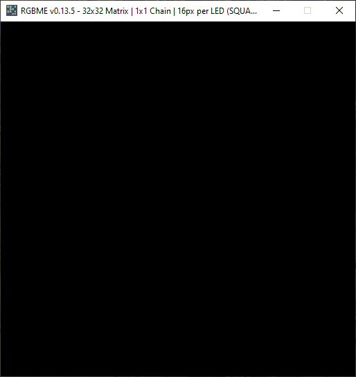

# `RGBMatrixEmulator`




`RGBMatrixEmulator` is a Python package for emulating RGB LED matrices that are normally driven by the `rpi-rgb-led-matrix` library. Most commonly, these are used with single-board computers such as the Raspberry Pi.

`RGBMatrixEmulator` (currently) supports a subset of the function calls present in the Python bindings for `rpi-rgb-led-matrix`. As such, it's accuracy is not 100% guaranteed.

## Installation

`RGBMatrixEmulator` is in the [Python Package Index (PyPI)](http://pypi.python.org/pypi/RGBMatrixEmulator/).
Installing with ``pip`` is recommended for all systems.

```sh
pip install RGBMatrixEmulator
```

## Usage

Projects that are able to be emulated will rely on importing classes from `rpi-rgb-led-matrix`. These will need to be replaced by equivalent `RGBMatrixEmulator` classes.

For example, usage on a Rasberry Pi might look like this:

```python
from rgbmatrix import RGBMatrix, RGBMatrixOptions
```

The emulated version will need to use `RGBMatrixEmulator` classes:

```python
from RGBMatrixEmulator import RGBMatrix, RGBMatrixOptions
```

After this, most of the existing command line arguments from the `rpi-rgb-led-matrix` library still apply. You should reference the [project README](https://github.com/hzeller/rpi-rgb-led-matrix/blob/master/README.md) for that library when necessary.

Startup of the existing script will be unchanged.

## Customization

The first time you run a script with the emulator enabled, a file called `emulator_config.json` will be created in the script's directory. This enables configurations to be customized on a per-script basis. The default configuration is as follows:

```json
{
  "pixel_size": 16,
  "pixel_style": "square"
}
```

Altering the `pixel_size` configuration will change how large the LEDs appear on your screen. This is helpful for emulating large matrices or on small screens.

You can also change the `pixel_style` option. By default, the emulator represents LEDs as squares. If you prefer the LEDs to have a more rounded appearance (like they would on an actual matrix), you can change to `pixel_style: "circle"`. 

## Screenshots


## Known Issues

- Calling draw functions on an instance of `RGBMatrix` is slow (i.e. `matrix.SetPixel`, `matrix.Fill`)
  - Prefer using on a `Canvas` instance instead
  - `rpi-rgb-led-matrix` uses a threaded implementation to handle single pixel draws with the `RGBMatrix` class, unfortunately `RGBMatrixEmulator` redraws the entire screen on each call
  - NOTE: the implementation is accurate other than speed (you _can_ still drop `RGBMatrixEmulator` into a project that makes calls to the matrix object)
  - <details>
    <summary>Expand Example</summary>
    
    ```python
    # SLOW
    matrix = RGBMatrix(options = RGBMatrixOptions)

    for y in matrix.height:
      for x in matrix.width:
        matrix.SetPixel(x, y, 255, 255, 255) # Redraws entire screen

    # FAST
    matrix = RGBMatrix(options = RGBMatrixOptions)
    canvas = matrix.CreateFrameCanvas()

    for y in matrix.height:
      for x in matrix.width:
        canvas.SetPixel(x, y, 255, 255, 255) # No redraw

    matrix.SwapOnVsync(canvas) # Force screen refresh
    ```
  </details>
- Drawing large strings is slow, partly because of the `linelimit` parameter in the BDF font parser this emulator uses to prevent multiline text from being rendered unintentionally.

## Contributing
If you want to help develop RGBMatrixEmulator, you must also install the dev dependencies, which can be done by running ``pip install -e .[dev]`` from within the directory.

Before submitting a PR, please open an issue to help us track development. All development should be based off of the `dev` branch. This branch is kept up-to-date with `main` after releases. 

## Contact

Tyler Porter

tyler.b.porter@gmail.com
